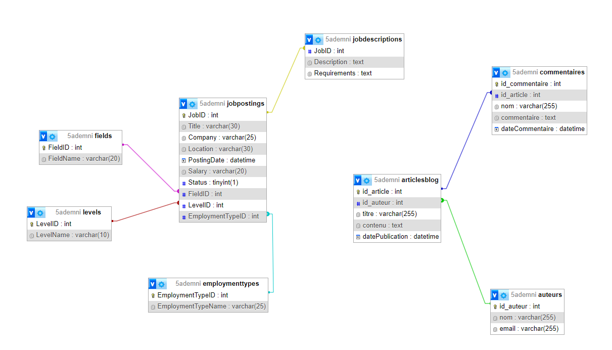
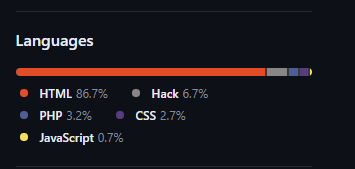

# REMEMBER TO SYNC YOU BRANCHES WITH THE MAIN BRANCH BEFORE PUSHING YOUR CODE

# projet-web-2A

## Features

- login,CRUD yada yada yada , all the basic stuff
- job scrapping
- ai chatbot with custom knowledge base
- job recommendation/matching system


trick to enable relation between sql tables in mysql:

```sql
SELECT CONCAT('ALTER TABLE ', table_name, ' ENGINE=InnoDB;') 
FROM information_schema.tables 
WHERE table_schema = '5ademni' AND engine = 'MyISAM';
```

### DATABASE SCHEMA



#### 02/04/2024

