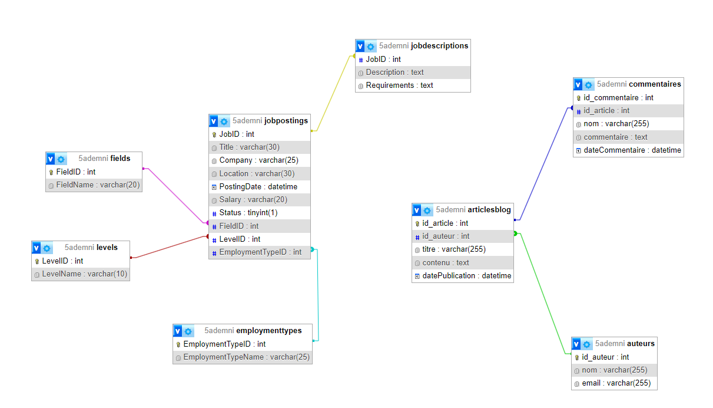

# 5ademni - Job Matching & Career Platform

<div align="center">
  <h3>A comprehensive web platform for job seekers and employers</h3>
  <p><em>Connecting talent with opportunities through intelligent matching and AI-powered assistance</em></p>
</div>

---

## 📋 Table of Contents

- [About the Project](#about-the-project)
- [Features](#features)
- [Technology Stack](#technology-stack)
- [Prerequisites](#prerequisites)
- [Installation](#installation)
- [Database Setup](#database-setup)
- [Project Structure](#project-structure)
- [Usage](#usage)
- [Contributing](#contributing)
- [Database Schema](#database-schema)

---

## 🎯 About the Project

**5ademni** (Arabic: "Help Me") is a full-stack web application designed to bridge the gap between job seekers and employers. The platform provides intelligent job matching, event management, training programs, and an AI-powered chatbot to assist users in their career journey.

---

## ✨ Features

### Core Functionality
- **User Authentication & Authorization**: Secure login and registration system with role-based access control
- **CRUD Operations**: Complete Create, Read, Update, Delete functionality for all entities
- **Admin Dashboard**: Comprehensive back-office management system

### Job Management
- **Job Posting System**: Employers can post job opportunities with detailed requirements
- **Job Application Tracking**: Track and manage job applications with ease
- **Job Field Categorization**: Organize jobs by industry and specialization

### Advanced Features
- **🤖 AI Chatbot**: Intelligent chatbot with custom knowledge base for career guidance
- **🎯 Job Recommendation Engine**: Smart matching system that connects candidates with suitable positions
- **📊 Job Scraping**: Automated job data aggregation from multiple sources
- **📅 Event Management**: Create and manage career events, workshops, and networking opportunities
- **📚 Training Programs**: Manage professional development and training courses
- **📝 Blog System**: Share career advice, industry insights, and company news
- **💬 Commenting System**: Interactive discussions on blog posts and events
- **📧 Notification System**: Email notifications using PHPMailer and SMS notifications via Twilio

---

## 🛠 Technology Stack

### Backend
- **PHP**: Server-side scripting language
- **MySQL**: Relational database management system
- **Python (Flask)**: AI chatbot backend service

### Frontend
- **HTML5/CSS3**: Modern web markup and styling
- **JavaScript**: Client-side interactivity
- **TinyMCE**: Rich text editor for content creation

### Libraries & Tools
- **PHPMailer**: Email sending functionality
- **Twilio PHP SDK**: SMS notifications
- **Poe API Wrapper**: AI chatbot integration
- **Flask-CORS**: Cross-origin resource sharing for Python backend

### Development Tools
- **phpMyAdmin**: Database administration
- **Composer**: PHP dependency management

---

## 📦 Prerequisites

Before you begin, ensure you have the following installed:

- **PHP** >= 8.0
- **MySQL** >= 5.7 or **MariaDB** >= 10.4
- **Apache** or **Nginx** web server
- **Composer** (for PHP dependencies)
- **Python** >= 3.8 (for AI chatbot)
- **pip** (Python package manager)

---

## 🚀 Installation

### 1. Clone the Repository

```bash
git clone https://github.com/5ademni/projet-web-2A.git
cd projet-web-2A
```

### 2. Install PHP Dependencies

```bash
cd view
composer install
```

### 3. Install Python Dependencies (for AI Chatbot)

```bash
cd view/chat
pip install flask flask-cors poe-api-wrapper
```

### 4. Configure Database Connection

Edit the database configuration file:

```bash
nano auth/config.php
```

Update the following parameters:

```php
self::$pdo = new PDO(
  'mysql:host=localhost;dbname=5ademni',
  'your_username',
  'your_password',
  // ...
);
```

---

## 💾 Database Setup

### Import Database Schema

Choose the appropriate SQL file based on your needs:

```bash
# Main database schema (recommended)
mysql -u your_username -p 5ademni < sql/5ademni_v2.sql

# Or individual modules:
mysql -u your_username -p 5ademni < sql/events.sql
mysql -u your_username -p 5ademni < sql/jobposts.sql
mysql -u your_username -p 5ademni < sql/blog.sql
mysql -u your_username -p 5ademni < sql/user.sql
```

### Database Tips

See `sql/tips.md` for useful database management commands.

---

## 📁 Project Structure

```
projet-web-2A/
├── auth/                    # Authentication configuration
│   ├── config.php          # Database connection settings
│   └── connexion.php       # User authentication logic
├── controller/             # Business logic controllers
│   ├── adminC.php
│   ├── jobPostC.php
│   ├── eventC.php
│   └── ...
├── model/                  # Data models (entities)
│   ├── admin.php
│   ├── jobPost.php
│   ├── event.php
│   └── ...
├── view/                   # Frontend views
│   ├── back_office/       # Admin dashboard
│   ├── front_office/      # User-facing pages
│   └── chat/              # AI chatbot (Python/Flask)
├── sql/                    # Database schemas
├── screenshots/            # Project screenshots
├── twilio-php-main/       # Twilio SDK for SMS
├── upload/                # User-uploaded files
└── README.md              # Project documentation
```

---

## 🎮 Usage

### Starting the Application

#### 1. Start Web Server

**Using PHP Built-in Server:**
```bash
php -S localhost:8000
```

**Or configure Apache/Nginx** to point to the project directory.

#### 2. Start AI Chatbot Service

```bash
cd view/chat
python app.py
```

The chatbot will be available at `http://localhost:5000`

#### 3. Access the Application

- **Frontend**: `http://localhost:8000/view/front_office/`
- **Admin Panel**: `http://localhost:8000/view/back_office/`
- **AI Chatbot**: Integrated into the frontend pages

### Default Admin Credentials

After database import, you can create an admin account through the admin panel or use any credentials set up in your database.

---

## 🤝 Contributing

We welcome contributions! To contribute:

1. **Sync your branch** with the main branch before making changes
   ```bash
   git checkout main
   git pull origin main
   git checkout -b feature/your-feature-name
   ```

2. **Make your changes** following the existing code style

3. **Test thoroughly** to ensure nothing breaks

4. **Commit with clear messages**
   ```bash
   git add .
   git commit -m "Add: description of your changes"
   ```

5. **Push and create a Pull Request**
   ```bash
   git push origin feature/your-feature-name
   ```

> **⚠️ Important**: Always sync your branches with the main branch before pushing your code!

---

## 📊 Database Schema

The application uses a comprehensive relational database structure with the following main entities:

- **Users & Authentication**: User accounts, roles, and permissions
- **Job Posts**: Job listings with detailed requirements
- **Applications**: Job application tracking
- **Events**: Career events and workshops
- **Formations**: Training and development programs
- **Blog**: Articles and career advice
- **Projects**: Portfolio and project showcase

### Entity Relationship Diagram



---

## 📝 License

This project is part of a Web Development course (2A) and is intended for educational purposes.

---

## 👥 Team

Developed by students as part of their 2nd year Web Development project.

---

## 📧 Contact & Support

For questions or support, please open an issue in the GitHub repository.

---

<div align="center">
  <p>Made with ❤️ by the 5ademni Team</p>
  <p><em>Empowering careers, one match at a time</em></p>
</div>